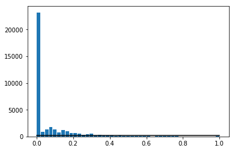
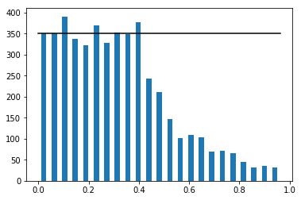
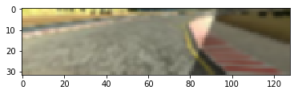

# **Behavioral Cloning** 

---

## Introduction

This project applies deep learning technics to mimic the driving behavior of a human driver. For ease, Udacity provides a simulator which can be used to teach the Neural Network how to behave (training mode) and to validate the efficiency of the model (autonomous mode). Two tracks are available in the simulator, a simple one used to generate the data and validate the deep learning architecture and a challenging one for the fun (to validate that neural network prediction generalizes well and extracts meaningful features). The problem of this project is to find a correlation between what the car sees and the steering angle that should be applied ; speed is regulated using PI controller therefore it wasn't taken into account. 

In training mode, the user drives normally while the simulator records images of embedded cameras and make different measurements such as throttle, steering, brake, etc.. In this particular case, the dashboard images are the inputs of the neural network and the steering angle is the output. This data is then preprocessed and fed into the neural network which (by knowing the output) adjusts its parameters. The parameters are then saved into a .h5 file and used to achieve autonomous driving on the simulator. 

The difficulties encountered in this project were to collect the data and to find a Deep Learning architecture to model the driver behavior. 

### Objectives

**Behavioral Cloning Project**

The goals / steps of this project are the following:
* Use the simulator to collect data of good driving behavior
* Build, a convolution neural network in Keras that predicts steering angles from images
* Train and validate the model with a training and validation set
* Test that the model successfully drives around track one without leaving the road
* Summarize the results with a written report

### Rubric Points
The rubric points can be found [here](https://review.udacity.com/#!/rubrics/432/view). 

### Previous project
After making my own idea of the project, I generally go through the internet to gather some hints and ideas. This project is a combination of my personal thoughts and the results obtained by previous learners who have been involved in this project. The [cheat-sheet]() was really helping by proposing an overview of the problems that we may deal with and guidelines to resolve to achieve autonomous driving. 

In his [submission](https://github.com/jeremy-shannon/CarND-Behavioral-Cloning-Project), Jeremy Shanon has detailled his approached to adjust the nVIDIA architecture to this specific situation. He proposed data augmentation technics that inspired this project. 

[Navoshta](https://github.com/navoshta/behavioral-cloning) has made a sraight forward job with a minimalist code that performs efficiently. The use of panda library is shown to be very efficient with minimal code. 

Both projects use generator (batching) to feed the network on different ways. 

I have tested both architectures (nVIDIA and Navoshta's), but the one from nVidia was more complicated (difficult to tune and slower to train), therefore I have chosen to continue using the architecture proposed by Navoshta ; it is simpler, more efficient and faster to train using a GPU. However, I have tried to make some changes : 
* Fed the Neural Network with YUV images : it does not influence the network prediction, so kept RGB images. I suppose it performs better on the nVIDIA architecture and real life images. 
* Used Nadam instead of Adam optimizer - decrease the loss-validation but does not generalize well while used on the track (poor result) so I kept Adam. 
* Added regularizer in each convolution and flatten layers - allow to decrease loss validation.
* Changed relu into elu loss activation function - allow to decrease loss validation.

### Hardware 
I collected the data using my laptop and I trained the model using an EC2 instance to benefit from the GPU fast calculation. At first, I coded the network using keras 2.x library, however, the instance couln't run this newer version of the package using its GPUs. Therefore, I came back to EC2 version of keras to benefit of the GPU calculation. 

---

## Files sumitted

My project includes the following files:
* <i>model.ipynb</i> containing the script to create and train the model - perform data processing as well
* <i>drive.py</i> for driving the car in autonomous mode 
* <i>model_moremoredata.h5</i> containing a trained convolution neural network 
* <i>video.mp4</i> is a video of autonomous driving on test track
* <i>writeup_report.ipynb</i> summarizing the procedure and the results
---

## Data collection

### Dataset
The dataset is generated while manually driving the car on the test track of the simulator. The software captures images from 3 different dashcameras, a center, left and right one. All these images are saved in directory and the file path of image is related to the actual steering angle in a .csv file. 

The procedure to collect the data consists of two steps : 
* Driving the car smoothly for 3 laps clockwise and 3 laps counter clockwise
* Perform recovery center driving for 2 laps clockwise and counter clockwise. This consists of getting closer to the right or left lane (while not recording) then turning recording on and get in the center lane. 

Without the second step of data collection, in automous driving, the car is not trained to deal with critical situation where it gets closer and closer of a border. Instead of getting back on the center lane, it just steers normally and, worst case, get off the track.

The dataset is then loaded into a panda DataFrame in python which fits the need of fast data precessing. This procedure provided a dataset of 37000 raw samples from Udacity dataset and my personal collection. 

Moreover, I've tried to have the same amount of data for each case, thus when balancing the data each state of the car (recovery or driving in center) has the same probability to be fed into the Neural Network. Thinking of it, it might be more interesting to have more center driving data since it is the normal behavior of driving ; this way the wiggeling I face may be limited. 

### Data formatting
The simulator records the images in a IMG directory and records in the csv file the absolute path to those images. It was necessary to transform the absolute path into a relative path to images and changing the format of windows \ to linux / in order to work on the instance ; those tasks are achieved by ``change_dir`` and ``convert`` and applied to the entire colmun of the dataset using ``apply`` function from Panda. 

### Balancing the dataset
As faced previoulsy in the traffic signs classification project, an unbalaced dataset could bring up biased prediction. In the raw dataset, there were plently of steering angles close to 0 (compared to the other values). Therefore, it was necessary to balance the data to avoid biased predictions.

### Dataset augmentation
#### Using left and right images
Each sample comprises 3 images (from center, left and right cameras) linked to a steering angle. I used all three images in my dataset by applying a correction factor of -0.25 for right images and 0.25 for left images. This method multiplied by 3 the amount of samples. 

#### Horizontal flip
It is also possible to flip the images horizontally (mirror), and take the opposite of the steering angle. This increases the number of samples by 2. 

#### Cropping
Each image is cropped to focus on the road area and are resized to fit the input shape of the network. Cropping allows the neural net to only extract features of troad surface, and allows faster training. This cropping is randomized as well to avoid overfitting. 

#### Shadowing 
To help the network to generalize and avoid overfitting, random shadow is added to each image while preprocessing. 

#### Bluring 
The raw images are pixelized and thus blurring the images facilitates the feature extraction. 

#### Normalization
Each raw RGB image is normalized into values within [-1,1] range. Normalizing the data improves the neural network efficiency.

#### Example result of preprocessed image

## Model Architecture and Training Strategy

### An appropriate model architecture has been employed
Two famous existing architectures may be used to achieve behavioral cloning : LetNet and Nvidia. Both of them are convolutional neural network (CNN), a typical structure which is liked when dealing with images. 

The community seems to prefer the Nvidia arrchitecture, which has been proven to work and is well documented in their [paper](https://arxiv.org/abs/1604.07316), reasons why I have chosen to start with this one. As mentioned by [Navoshta](https://github.com/navoshta/behavioral-cloning), the Nvidia architecture may be too complicated for this specific situation, indeed Nvidia developped their CNN to achieve behavioral cloning in real-life situation, thus I find interesting the way [Navoshta](https://github.com/navoshta/behavioral-cloning) simplified the network. Moreover, the more complicated the network is, the more data should be used. In this case, the dataset are limited which could be problematic to train Nvidia network. 

Even if the Navoshta's architecture was ready to play, I tried to integrate the observations of Shannon within the simplified CNN. Therefore I changed RELU into ELU activation layer, and added kernel regularizer for each layer. I tried different loss functions but the mean squared error performed the best. Different optimizers have been tested, but Adam, was performing the best after all. 

Caption : The Nvidia CNN. 

Caption : The adapted CNN from Navoshta. 

#### Training 
I trained the network using 8955 samples which have been shuffled and separated into a training (80%) and validation (20%). The leanring rate was set to $10^{-4}$ and the learning proceded for 20 epochs. 

#### Overfitting and generalization
ELU activation layers seems to allow the network to generalize well. Dropout layers were already implemented in the CNN, which is generally used to avoid overfitting. 

The dataset is randomized as well and preprocessed to avoid overfitting and generalization. 

#### Generator
A generator is implemented to preprocess the data and feed batch per batch to the network while training. Working with large amount of sample could saturate the memory. it is also a convinient way to apply preprocess to the network. 

## Result and discussion

The autonomous driving around the test track can be find [here](https://youtu.be/_u5iFYcNNCM). The car performs well, but not perfectly ; there is too much wiggeling and sometimes the vehicle leaves the center lane. 

First thing to improve is the dataset itself ; collect the data at really low speed and make sure to stay in the center of the road in any condition. I think the recovery dataset caused the car to wiggel, when I collected the data I set the car next to a lane (then record) and proceeded to return at the center of the road, I think it would be enough to just record the moment when you steer back to center of the track. Thus, the network is trained to avoid going out of the track instead of going to the center. 

Wrapping the images to simulate hills would be great data augmentation process that would allow the car to peform better on the challenge track. 

Even if this exercice seems to be simple, it applies casual technics of data preparation and augmentation, training, etc. that are also applied in large project. Moreover, it proves that neural networks are powerful tools but sensible to the training data. 
